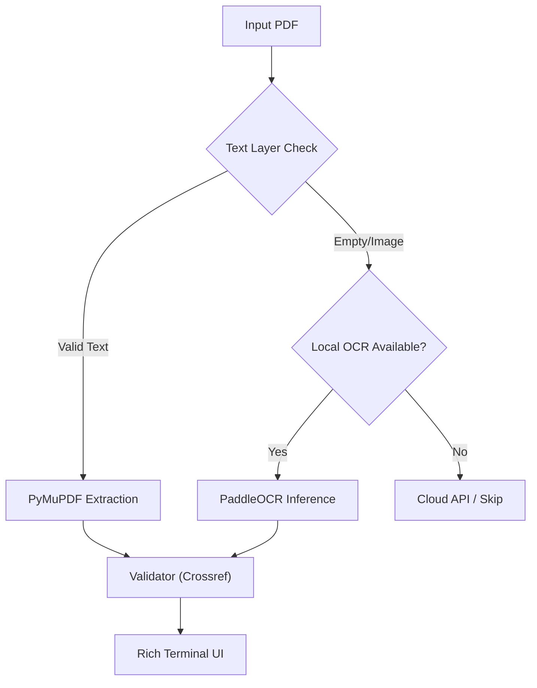

# VeriCite (VeriCite CLI)

> **Context-Aware Verification for the AI Era.**  
> **面向 AI 时代的学术引用完整性校验工具**

[](https://opensource.org/licenses/MIT)
[](https://www.python.org/downloads/)

VeriCite 是一个智能化的学术引用校验工具。它致力于解决**AI 幻觉引用**和**虚假引用凑数**两大痛点。

我们的核心理念是**"文本优先，视觉兜底" (Text First, Visual Fallback)**。对于绝大多数原生电子版论文（Digital Born），我们直接提取文本层进行毫秒级验证；只有在处理老旧扫描件或极端复杂排版时，才自动降级使用 OCR 技术。

---

## 🌟 核心价值与版本策略 (Open Core)

VeriCite 采用 **Open Core** 模式。基础校验逻辑完全免费且开源，Pro 版提供更强大的云端视觉能力。

### 📦 Community Edition (开源社区版)
**"极速，隐私，够用"**
完全免费，源代码托管于 GitHub。

*   **✅ 智能路由 (Smart Routing)**：
    *   **Level 1**: 优先使用 PyMuPDF 直接提取文本（覆盖 90% 场景，无需 GPU，极速）。
    *   **Level 2**: 遇到扫描件自动降级使用 `PaddleOCR`（需本地安装）。
*   **✅ 核心校验引擎**：直连 Crossref/Semantic Scholar 验证引用真实性。
*   **✅ 隐私优先**：默认在本地完成所有处理，不上传文件。

### 🚀 Pro / Enterprise (商业云端版)
**"解决最后 5% 的疑难杂症"**
适合处理古籍、手写稿或需要批量处理的机构用户。

*   **⚡ Cloud VLM 引擎**：接入 **DeepSeek-OCR / GLM-OCR**，解决双栏断行、公式混排等 OCR 难题。
*   **⚡ 批量处理**：一键扫描文件夹，生成聚合报告。
*   **⚡ PDF 标注**：直接在原 PDF 上高亮显示存疑引用。

---

## 🛠️ 安装 (Installation)

### 1. 基础安装 (推荐)
只包含核心功能（PyMuPDF + 校验器），体积小，无需 GPU。
```bash
pip install vericite
```

### 2. 完整安装 (可选)
如果您需要处理扫描件，请额外安装 PaddleOCR：
```bash
pip install paddlepaddle paddleocr
```
*(注: PaddleOCR 初次运行会自动下载模型权重)*

---

## 💻 使用指南 (Usage)

### 基础扫描
```bash
vericite scan ./paper.pdf
```
系统会自动判断：
1. 如果是电子版 -> 秒级出结果。
2. 如果是扫描件且已安装 Paddle -> 自动调用 OCR。
3. 如果是扫描件但未安装 Paddle -> 提示安装或报错。

---

## 🏗️ 技术架构



---

## 📄 许可证 (License)

本项目采用 **MIT 许可证**。
