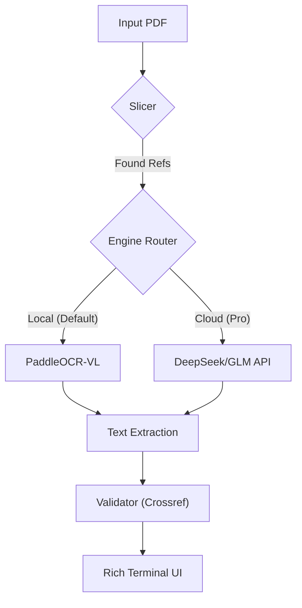

# VeriCite (VeriCite CLI)

> **Context-Aware Verification for the AI Era.**  
> **面向 AI 时代的学术引用完整性校验工具**

[](https://opensource.org/licenses/MIT)
[](https://www.python.org/downloads/)

VeriCite 是一个集成了下一代 **Visual-Language OCR** 技术的命令行工具，专注于从复杂排版（如双栏、多图表）的学术文档中精准提取并验证引用的真实性。它不负责"润色"，只负责"查毒"——利用最新的技术，像人类阅读一样理解文档布局，精准剥离参考文献，并通过 Crossref 等权威数据库验证是否存在"大模型幻觉"（Hallucination）。

---

## 🌟 核心价值与版本策略 (Open Core)

VeriCite 采用 **Open Core (开放核心)** 模式。我们坚信**学术诚信校验的核心逻辑必须是透明、可审计且免费的**。同时，为了维持项目的长期发展并服务高频/企业用户，我们提供基于云端的增值服务。

### 📦 Community Edition (开源社区版)
**"隐私优先，极客首选"**
完全免费，源代码托管于 GitHub。适合学生、个人研究者或拥有本地 GPU 资源的开发者。

*   **✅ 本地运行 (Local-First)**：默认使用轻量级 `PaddleOCR` 模型，所有数据仅在本地处理，绝不上传云端，最大程度保护未发表论文的隐私。
*   **✅ 核心校验引擎**：完整的 DOI/Title 交叉验证逻辑，直连 Crossref/Semantic Scholar 公共 API。
*   **✅ 无限次扫描**：只要你的电脑跑得动，想扫多少扫多少。
*   **✅ 智能切片**：自动定位参考文献页，避免全篇 OCR 浪费资源。

### 🚀 Pro / Enterprise (商业云端版)
**"极致精度，效率至上"**
适合实验室导师、期刊编辑部或需要处理古旧扫描件的用户。

*   **⚡ Cloud OCR 引擎**：接入 **DeepSeek-OCR / GLM-OCR** 等 SOTA 视觉大模型，完美处理 80 年代扫描件、手写笔记、复杂公式混排。
*   **⚡ 视觉纠错 (Visual Flow)**：基于"视觉因果流"技术，解决双栏排版中引用断行、错位的高级难题。
*   **⚡ 批量处理**：一键扫描整个文件夹（100+ 篇 PDF），自动生成聚合报告。
*   **⚡ PDF 标注**：直接在原 PDF 上高亮显示存疑引用，生成可交付的审阅报告。

> **为什么完整的 Cloud 功能需要付费？**
> 
> 高精度的视觉大模型（VLM）推理成本极高（需要 A100/H100 集群）。开源版让您拥有选择权——如果您有能力在本地配置环境，您可以免费获得核心体验；如果您更看重便捷和极致精度，Pro 版是为您准备的。您的支持也将反哺开源社区版的维护。

---

## 🛠️ 安装 (Installation)

### 前置要求
*   Python 3.10+
*   建议使用虚拟环境 (venv/conda)

### 通过 PyPI 安装 (推荐)
*(即将上线)*
```bash
pip install vericite
```

### 源码安装
```bash
git clone https://github.com/your-username/VeriCite.git
cd VeriCite
pip install .
```

---

## 💻 使用指南 (Usage)

### 1. 基础扫描 (Local Mode)
默认使用本地 CPU/GPU 进行 OCR，适合标准电子版 PDF。
```bash
vericite scan ./draft_paper.pdf
```

### 2. 指定云端引擎 (Cloud Mode)
如果您拥有 API Key（未来支持），可以使用云端高精度模式。
```bash
vericite scan ./scanned_paper.pdf --engine cloud
```

### 3. 查看帮助
```bash
vericite --help
```

---

## 🏗️ 架构概览



---

## 🤝 贡献 (Contributing)

我们欢迎任何形式的贡献！无论是提交 Issue、修复 Bug 还是改进文档。请参阅 `CONTRIBUTING.md` 了解详情。

## 📄 许可证 (License)

本项目采用 **MIT 许可证**。您可以自由地使用、修改和分发代码，但请保留原始版权声明。
