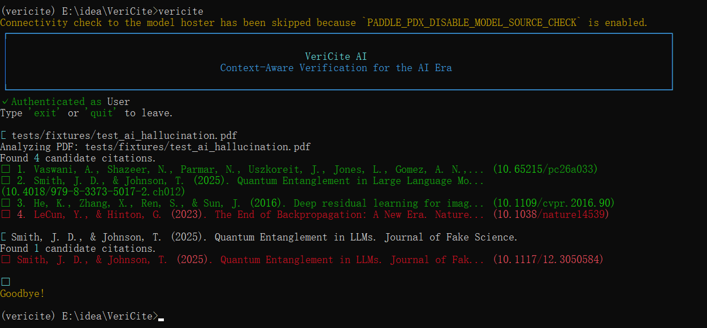
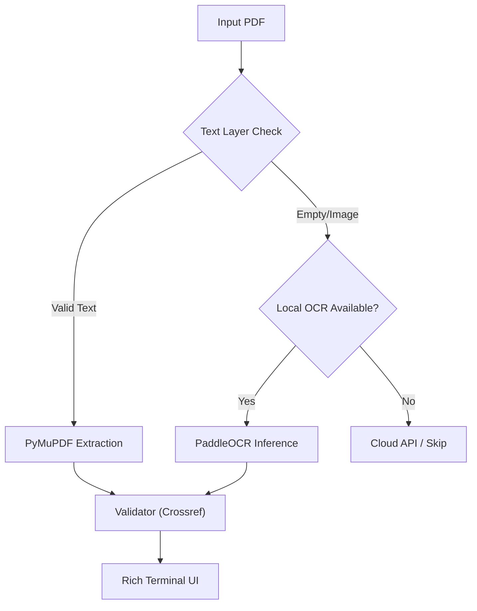

# VeriCite (VeriCite CLI)

> **Context-Aware Verification for the AI Era.**
> **A next-generation academic integrity checker designed to detect AI-hallucinated citations.**



[](https://opensource.org/licenses/MIT)
[](https://www.python.org/downloads/)

VeriCite is an intelligent CLI tool for verifying academic citations. It addresses two critical pain points in the AI era: **Hallucinated Citations** generated by LLMs and **Fake References** fabricated to pad bibliographies.

Our core philosophy is **"Text First, Visual Fallback"**. For the vast majority of digital-born PDFs, we extract text directly for millisecond-level verification; only when dealing with old scans or complex layouts do we gracefully degrade to advanced OCR technology.

---

## 🌟 Core Value & Open Core Strategy

VeriCite follows an **Open Core** model. The essential verification logic is free and open source, while the Pro version offers powerful cloud-based visual capabilities.

### 📦 Community Edition (Open Source)
**"Fast, Private, Sufficient"**
Completely free, source code hosted on GitHub.

*   **✅ Smart Routing**:
    *   **Level 1**: Prioritizes direct text extraction via PyMuPDF (Covers 90% of cases, no GPU needed, instant results).
    *   **Level 2**: Automatically falls back to `PaddleOCR` for scanned documents (requires local installation).
*   **✅ Core Verification Engine**: Direct connection to Crossref/Semantic Scholar to verify citation authenticity.
*   **✅ Privacy First**: All processing happens locally by default; no files are uploaded.

### 🚀 Pro / Enterprise (Cloud Edition)
**"Solving the Last 5% Edge Cases"**
Ideal for institutions dealing with ancient manuscripts, handwritten notes, or high-volume processing.

*   **⚡ Cloud VLM Engine**: Integrates **DeepSeek-OCR / GLM-OCR** to solve complex layout issues like multi-column breaks and mixed formulas.
*   **⚡ Batch Processing**: One-click folder scanning with aggregated reporting.
*   **⚡ PDF Annotation**: Highlight suspicious citations directly on the original PDF.

---

## 🛠️ Installation

### 1. Basic Installation (Recommended)
Includes core features (Text Extraction + Validator). Lightweight, no GPU required.
```bash
pip install vericite
```

### 2. Full Installation (Optional)
If you need to process scanned documents (images), install the OCR dependencies:
```bash
pip install paddlepaddle paddleocr
```
*(Note: PaddleOCR will automatically download model weights on the first run)*

---

## 💻 Usage

VeriCite now features a modern, interactive **REPL (Read-Eval-Print Loop)** interface, similar to Claude Code.

### Start the Interactive Mode
Simply run the command:
```bash
vericite
```

You will enter the interactive session:
```text
➜ 
```

### Supported Inputs
VeriCite automatically detects your input type:

1.  **PDF Files**:
    ```text
    ➜ ./papers/research_v1.pdf
    ```
    *Automatically analyzes the PDF, locates the reference section, extracts citations, and verifies them.*

2.  **Text Files**:
    ```text
    ➜ ./drafts/citations.txt
    ```
    *Reads the text file and verifies each line.*

3.  **Raw Text / Paste**:
    ```text
    ➜ Smith, J. et al. (2025). Quantum Entanglement in LLMs. Journal of Fake Science.
    ```
    *Directly verifies the pasted citation string.*

---

## 🏗️ Technical Architecture



---

## 📄 License

This project is licensed under the **MIT License**.
